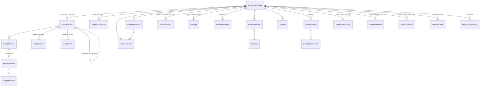
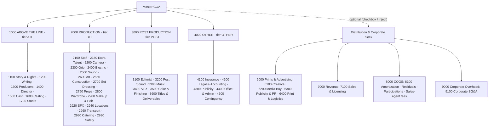
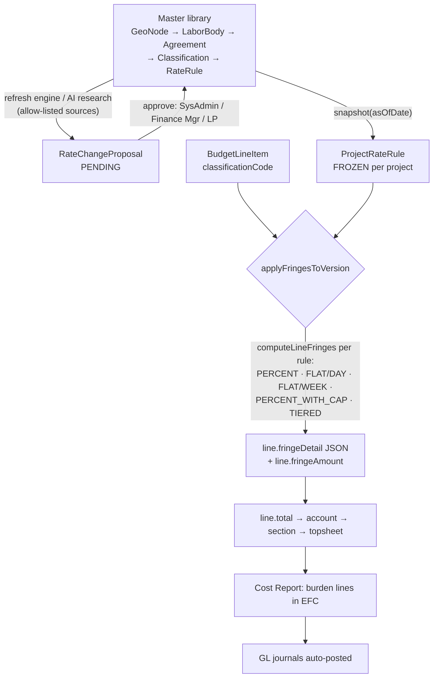
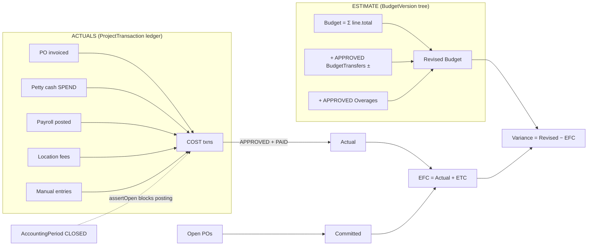
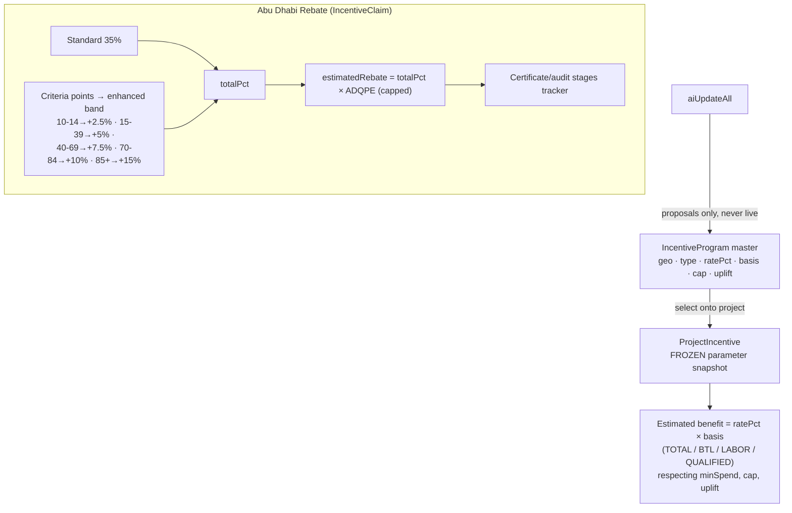
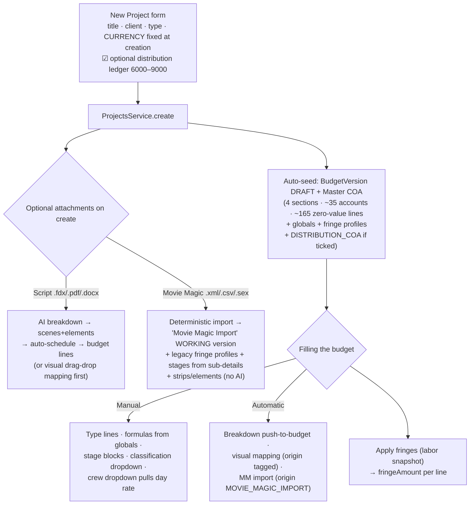
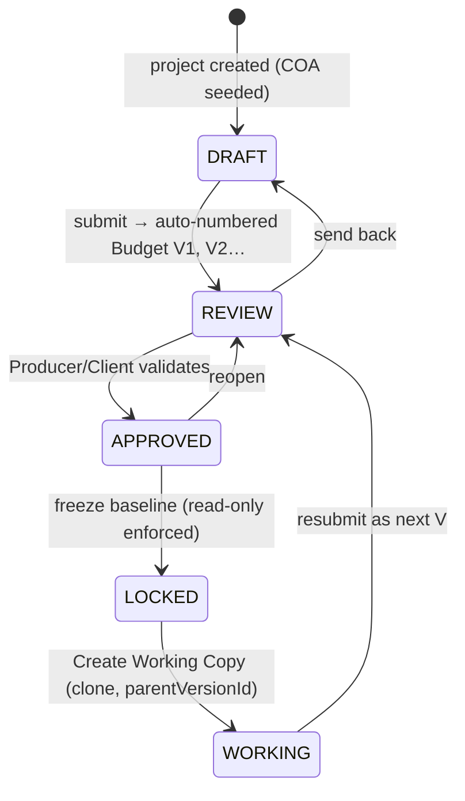

# 14 — Production System: Flows & Charts (Master Visual Reference)

One consolidated, current view of the production module: data relations, budget layout & math, fringe infusion, budget↔accounting workflow, rebates, project-creation paths, draft-vs-locked behaviour, and the file map. Diagrams are Mermaid — they render as charts in VS Code (with the Mermaid extension), GitHub, and most markdown viewers.

---

## 1. Data structure & relations (ER chart)



**Soft links (joined by string code, not FK):** `ProjectTransaction.accountCode`, `Overage.accountCode`, `BudgetTransfer.fromCode/toCode` all reference `BudgetAccount.code` — so actuals reconcile at **cost-center grain** across budget versions. `BudgetLineItem.crewMemberId` links a line to a crew member (name badge + rate pull); `classificationCode` links it to frozen fringe rules.

---

## 2. Budget layout & value math

**Hierarchy (seeded on every new project from the Master COA — doc 13, expanded doc 15):**
```
BudgetVersion (DRAFT)                       e.g. status DRAFT, versionSequence 0
 └─ BudgetSection  1000 ATL │ 2000 BTL │ 3000 POST │ 4000 OTHER   (tier explicit)
     │             [+ optional 6000 P&A │ 7000 Revenue │ 8000 COGS │ 9000 Corporate]
     └─ BudgetAccount  1300 Producers, 2200 Camera …               (cost centers, ~35 seeded)
         └─ BudgetLineItem  1303 Line Producer …                   (~165 seeded at qty1×rate0)
```

**Per-line value math (computed on every save, stored on the line):**
```
quantity   = quantityFormula evaluated against BudgetGlobals (e.g. shoot_days + prep_days)  else manual qty
subtotal   = Σ stages[].qty × stages[].rate         (when the prep/shoot/wrap stage block is used)
           = quantity × rate ÷ exchangeRate         (otherwise)
fringeAmount = subtotal × fringePct/100             (simple profile)  OR  Σ union-rule burdens (see §3)
total      = subtotal + fringeAmount
```
Line extras: `code/subTitle` (sub-account grouping, e.g. `1301`), `origin` provenance (MANUAL / AI_GENERATED / SCRIPT_IMPORT / AUTO_BREAKDOWN / MANUAL_OVERRIDE / MOVIE_MAGIC_IMPORT) with `aiSuggestedRate/Quantity` preserved on override, `classificationCode` (per-section dropdown), `crewMemberId` (crew link + rate pull).

---

## 2b. Master Chart of Accounts structure

Defined once at module level in `projects.service.ts` (`MASTER_COA` + `DISTRIBUTION_COA`), inserted through the shared `seedSections()` helper. Tier is **explicit per section** — never derived from the code prefix.



| | Sections | Accounts | Seeded lines | Notes |
|---|---|---|---|---|
| **MASTER_COA** (always) | 4 | ~35 | ~165 | every line `qty 1 × rate 0, units "allow"`; labor lines carry `classificationCode` (WRITER · PRODUCER · DIRECTOR · PERFORMER · STUNT · BG · DRIVER · CREW) so the fringe engine fires the moment a rate is typed |
| **DISTRIBUTION_COA** (optional) | 4 | 7 | ~27 | tier `OTHER`, sortOrder 6–9; added at creation (checkbox) **or** later via `POST /projects/:id/inject-distribution` — guards: active version exists · not LOCKED · no duplicate 6000+ codes · totals re-rolled |

Actuals for the 6000+ block post with the new `ProjectTxnKind` values **`SALES_REVENUE`** (folded as income) and **`CORPORATE_OVERHEAD`** (folded as cost) and reconcile by `accountCode` like everything else. Full line-by-line tables: doc 13 (production COA) and doc 15 (distribution block).

---

## 3. Fringe infusion — from master library to the working budget



Key behaviours:
- The snapshot is **immutable**: master rate updates never change a project until *Apply updates* is explicitly chosen. Historical/locked budgets are forever reproducible.
- **Fringes are per-version**: running *apply fringes* recomputes `fringeAmount/fringeDetail` on the lines of **that version only**. A LOCKED baseline's lines are guarded read-only, so its fringes are frozen with it; the WORKING copy carries its own lines and absorbs all recalculation. The dual topsheet (§7) then shows the drift between the two.
- Payroll reuses the same pure engine: timecards compute gross + the same classification burdens before posting.
- **Movie Magic legacy fringes:** an MMB import creates one `FringeProfile` per distinct percentage found in the file ("MMB Legacy Fringe 18.5%") and links the lines to it — imported totals match the file to the penny and survive later edits, until you replace them with statutory rules from the snapshot.

---

## 4. Budget ⇄ Accounting workflow (estimate vs actual)



- Reconciliation is **by `accountCode`** on every COST transaction.
- The same numbers feed all six surfaces (Budget vs Actual, Cost Report, Purchasing, Accounting, Cash, Overages) plus the shared FinanceSummaryStrip — one ledger, one revised-budget picture.
- Money moves only through gates: transfers and overages are PENDING until approved; OCR-drafted invoices are `DRAFT` until a human approves; closed periods reject any posting (ledger, PO invoice, petty spend, payroll, payment run).

---

## 5. Rebate / incentive structure



---

## 6. New-project creation & how the budget gets filled



Every automatic path **tags provenance** (`origin`) and archives the suggested numbers; a human edit flips the line to `MANUAL_OVERRIDE` without losing the original.

**Re-importing Movie Magic later (Settings tab)** offers two merge strategies: *New version* (replace the active budget with a fresh import) or *Update active* (departmental upsert — sections/accounts matched by code, line items replaced only inside accounts present in the file; refuses LOCKED). The distribution ledger can likewise be added post-creation from Settings.

---

## 7. Lifecycle: draft → locked baseline → working copy → dual topsheet



- Transitions are **role-gated** (project crew EP / Producer / Line Producer, or SysAdmin/Finance) and every change writes a `BudgetLifecycleLog` (who, role, when, why).
- **Fringes & the draft/working budget:** edits and fringe recalculation only ever touch the editable version. The LOCKED baseline keeps the exact totals (including fringes) it had at freeze.
- **Seeing the locked budget in the Top Sheet:** the Top Sheet tab is the **comparison workspace** — pick `Baseline: Budget V1 (Locked)` and `Working: Working Copy`, and the grid shows per-section `Locked Baseline | Current Working | Variance` (variance = baseline − working; red = working is over), with grand totals and the change-history timeline underneath.

```
Code  Department          Locked Baseline   Current Working   Variance
1000  Above The Line        450,000.00        485,000.00      -35,000
2000  Production (BTL)    1,200,000.00      1,150,000.00      +50,000
GRAND TOTALS             1,950,000.00      1,950,000.00            0
```

---

## 8. File map — where everything lives

**Backend (`backend/src/`)**
| Area | Files |
|---|---|
| Projects, COA seed, workflow, currency convert, role dashboards | `production/projects/projects.service.ts` + controller |
| Budget tree, lifecycle state machine, dual topsheet, lock/clone, provenance | `production/budget/budget.service.ts` + controller |
| Cost report/EFC, transfers, POs+OCR invoice intake, vendors+supplier link, petty cash, cashflow, finance summary | `production/costing/costing.service.ts` + controller |
| Actuals ledger, AP aging, payment run, period close, GL | `production/ledger/ledger.service.ts` + controller |
| Stripboard/DOOD/auto-schedule | `production/scheduling/` |
| Breakdown, script AI import, visual mapping apply | `production/breakdown/breakdown.service.ts`, `script-import.service.ts` |
| Payroll timecards → burdened costs | `production/payroll/` |
| Locations + fee posting | `production/locations/` |
| Vendor self-onboarding (JWT link, staging, approve) | `production/vendor-onboarding/` |
| Movie Magic import/export | `production/movie-magic/` |
| Union/fringe engine, snapshots, proposals, incentives, AD claim | `labor/labor.service.ts`, `labor/fringe-engine.ts` |
| Data model (all of it) | `prisma/schema.prisma` |

**Frontend (`frontend/src/`)**
| Area | Files |
|---|---|
| Project workspace (all tabs, budget grid, classification+crew dropdowns) | `app/(dashboard)/production/projects/[id]/page.tsx` |
| Topsheet comparison, cost report, finance strip, purchasing, accounting, cash, overages, mapping modal… | `components/production/*.tsx` |
| Offline PWA queue | `lib/offline-db.ts`, `lib/useOfflineSync.ts`, `public/sw.js` |
| API surface | `lib/api.ts` |
| Public vendor onboarding | `app/vendor-onboarding/[token]/page.tsx` |
| Branded PDFs | `app/print/{budget,topsheet,fringe,costreport,callsheet,schedule,breakdown,dealmemo,credits}/` |

**Documentation (`docs/production/`)** — `README` (index & concepts) · `01` data model · `02` projects · `03` budget · `04` finance/accounting · `05` crew/people · `06` union/fringes · `07` rebates · `08` AI · `09` API reference · `10` Movie Magic · `12` lifecycle & topsheet · `13` COA & crew link · `14` this file · `15` distribution ledger & MM import refactor.
