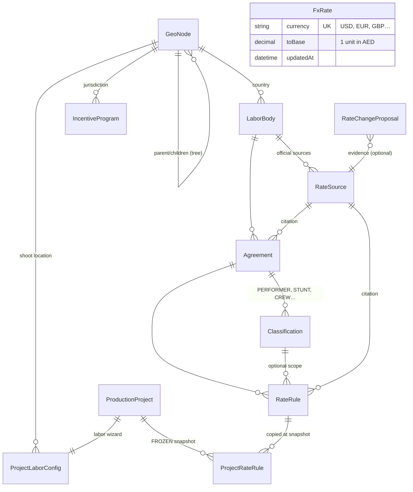
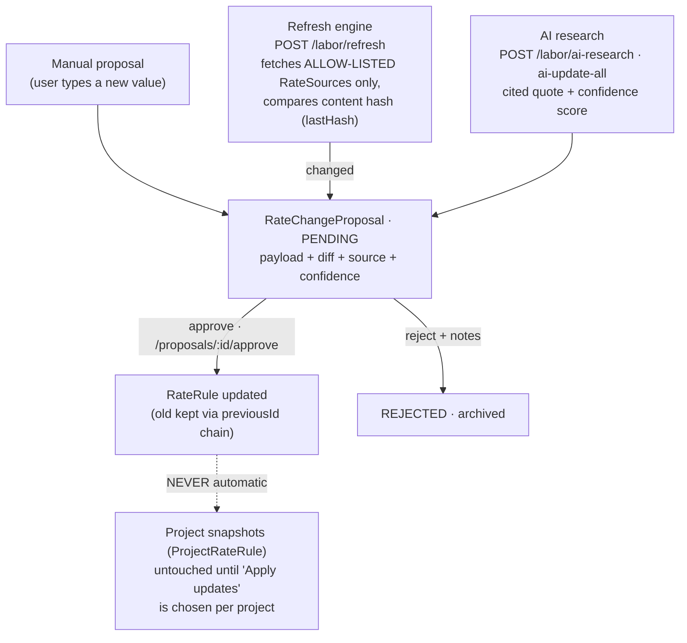
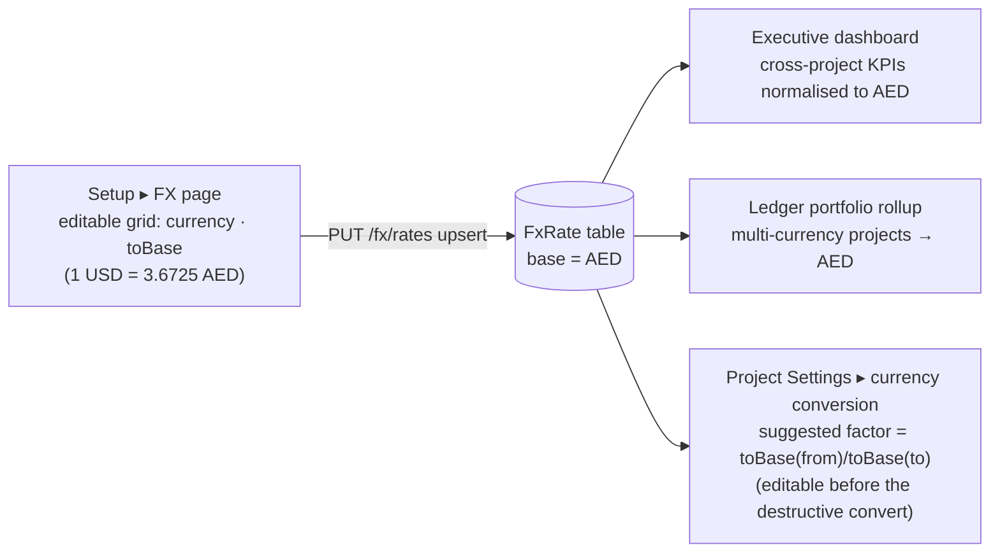
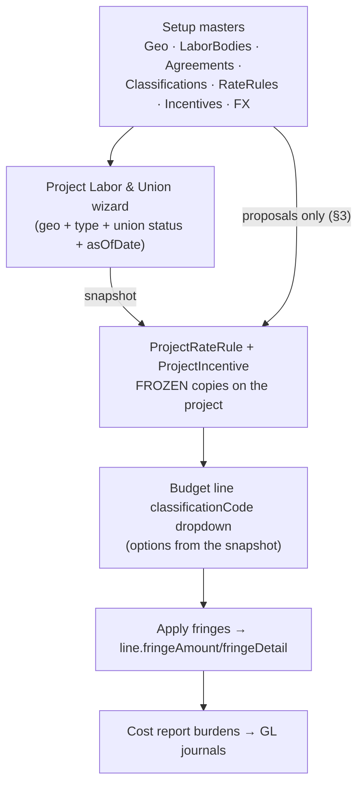

# 16 — Setup: Labor & Fringe Master · Rate Approvals · Currencies & FX (Flows & Charts)

The same visual treatment as doc 14, for the three Setup surfaces: **Setup ▸ Labor & Fringe Master** (`/setup/labor`), **Setup ▸ Rate Approvals** (`/setup/rate-approvals`) and **Setup ▸ Currencies & FX Rates** (`/setup/fx`). Diagrams are Mermaid.

---

## 1. Data structure & relations (ER chart)



**Key fields:**
- `GeoNode` — `level` (COUNTRY/STATE/CITY…), self-parented tree; everything geographic hangs off it.
- `LaborBody` — `kind`: UNION · GUILD · STATUTORY · PAYROLL_PROVIDER (e.g. SAG-AFTRA, IATSE, UAE MOHRE).
- `Agreement` — `productionTypes` JSON applicability, `tier`, `effectiveDate/expirationDate`, status DRAFT/ACTIVE/SUPERSEDED/EXPIRED.
- `RateRule` — the atom of the fringe engine (see §2).
- `RateSource` — `url`, `publisher`, **`trusted` allow-list flag**, `lastHash/lastStatus/lastCheckedAt` (refresh change-detection).
- `RateChangeProposal` — `origin` MANUAL/REFRESH/AI, `payload` (proposed rule), `diff` (old vs new), `confidence`, status PENDING/APPROVED/REJECTED.
- `ProjectLaborConfig` — per-project wizard answers: geo, productionType, unionStatus (UNION/NON_UNION/MIXED), selected `laborBodyIds`, **`asOfDate`** (rate-resolution date), `snapshotAt`.
- `FxRate` — one row per currency; `toBase` = value of **1 unit in AED** (base from `BASE_CURRENCY` env, default AED). Base itself is implicit `1`.

---

## 2. Labor & Fringe Master — anatomy of a rate rule

The `/setup/labor` page has three tabs — **Bodies & agreements** (drill: body → agreements → classifications → rate rules) · **Geography** (the GeoNode tree) · **Incentives** (program master, doc 14 §5).

```
RateRule
 ├─ label            "SAG-AFTRA Pension"
 ├─ rateType         PENSION · HEALTH · PENSION_HEALTH · PAYROLL_TAX · WORKERS_COMP ·
 │                   UNEMPLOYMENT · VACATION_PAY · HOLIDAY_PAY · EMPLOYER_TAX ·
 │                   UNION_DUES · GUILD_CONTRIB · STATUTORY_GRATUITY · HANDLING_FEE · OTHER
 ├─ calcMethod       PERCENT (value 0.205 = 20.5%) · FLAT_PER_DAY · FLAT_PER_WEEK ·
 │                   PERCENT_WITH_CAP (capPeriod + capAmount wage ceiling) · TIERED (tiers JSON)
 ├─ scope            agreement-wide, or narrowed to one Classification
 ├─ money            currency · floorAmount · glAccountCode (→ Chart of Accounts)
 └─ provenance       sourceId (citation) · effectiveDate/expirationDate ·
                     approvedById/At · previousId (version chain) · isEstimate flag
```

- Editing a live rule **does not overwrite it** — `updateRateRule` versions via `previousId`, so every historical value stays reproducible.
- `isEstimate` marks uncited/approximate values; the UI badges them until a trusted citation lands.
- Master CRUD requires **setup level 2**; reads are production level 1.

---

## 3. Rate update workflow — three origins, one approval gate



- **Nothing reaches a live rate without human approval** — refresh and AI only ever create PENDING proposals.
- The refresh engine fetches **only `trusted` allow-listed sources** and records `lastStatus` (OK / BLOCKED / ERROR / NOT_ALLOWLISTED) per source.
- Historical and locked projects are immune: their `ProjectRateRule` snapshot is frozen; *Check updates* on a project shows drift, *Apply updates* opt-in copies the new values forward (level-2, per rule).

---

## 4. Rate Approvals page (`/setup/rate-approvals`)

The review queue for §3. Each PENDING card shows: origin badge (MANUAL/REFRESH/AI), the **old → new diff**, the cited source (publisher + quote for AI proposals), confidence %, and Approve / Reject with notes. Approving writes `reviewedById/At` and applies the payload through the versioned update; the pending count badges the sidebar. Buttons on this page also trigger **Refresh sources** and **AI research** directly.

---

## 5. Currencies & FX Rates (`/setup/fx`)



Three distinct FX concepts — don't conflate them:

| Concept | Where | Behaviour |
|---|---|---|
| **Master FX table** | `FxRate` (this page) | Reference rates for *reporting* rollups; editing it re-prices dashboards instantly but **never rewrites stored project amounts** |
| **Per-line `exchangeRate`** | `BudgetLineItem` | Manual per-line divisor in the budget math (`qty × rate ÷ exchangeRate`); frozen with the line |
| **Project currency conversion** | Project Settings | One-time **destructive rewrite** of every stored amount at a confirmed factor (FX table only *suggests* the factor); no auto-undo — reverse by converting back at the inverse rate |

Rates are **manual-entry by design** (no external FX feed is called), consistent with the no-unapproved-sources policy.

---

## 6. How Setup feeds the project workflow (end to end)



---

## 7. File map

| Area | Files |
|---|---|
| Labor master + fringe engine + proposals + refresh + AI + incentives + claim | `backend/src/labor/labor.controller.ts`, `labor.service.ts`, `fringe-engine.ts` |
| FX rates | `backend/src/fx/fx.service.ts` + controller (consumed by `dashboard.service.ts`, `production/ledger/ledger.service.ts`) |
| Setup pages | `frontend/src/app/(dashboard)/setup/{labor,rate-approvals,fx}/page.tsx` |
| Project-side wizard & fringe panels | `frontend/src/components/production/ProjectLaborPanel.tsx`, `IncentivesPanel.tsx` |
| API helpers | `frontend/src/lib/api.ts` (`laborApi`, `fxApi`) |
| Data model | `backend/prisma/schema.prisma` (GeoNode → RateChangeProposal block, `FxRate`) |
| Related docs | `06-union-fringes.md` (engine detail) · `07-rebates-incentives.md` · `14-system-flows-and-charts.md` (project-side flows) |
