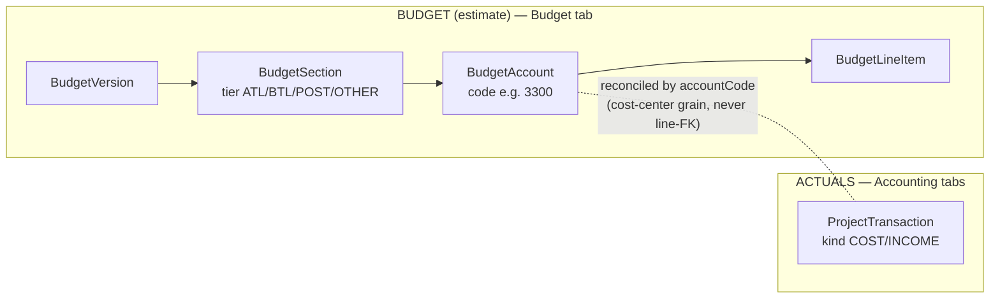
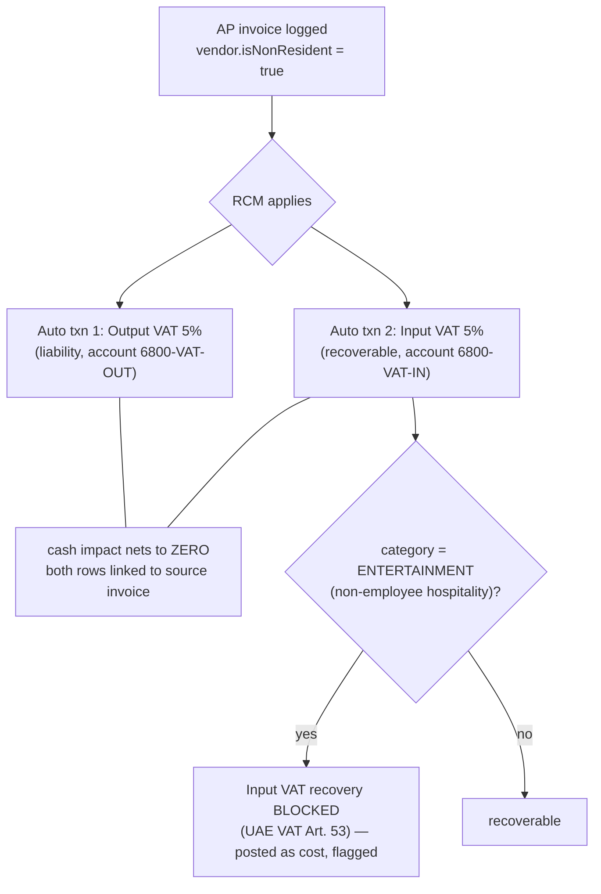
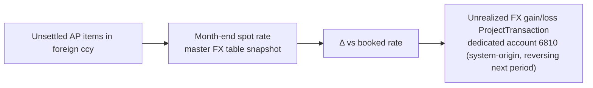
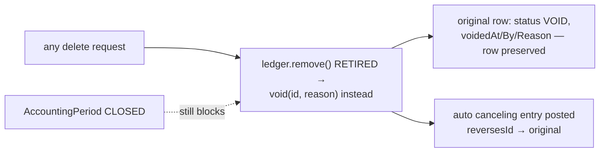
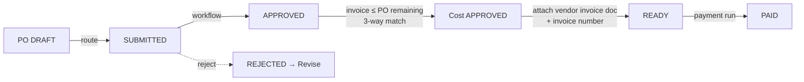

# 18 — Project Budget & Accounting: Structure, Flows & Charts
## v2 — Studio-Grade Architecture (current core + enhancement spec)

**Master deep-search reference** for everything money inside a production project, now extended with the **studio-grade enhancement architecture**: episodic amortization, GCC/Levant e-invoicing (ZATCA Fatoora, Jordan JoFotara), withholding tax, UAE RCM & corporate-tax settlement, FX revaluation, SOX-grade immutability, digital treasury, and the weekly financier cost-report engine.

> **Status legend** — every element is tagged:
> ✅ IMPLEMENTED (live in code today) · 🔶 SPEC (approved architecture, implementation phase pending)
> Companion machine-readable index: `18-budget-accounting-structure.json` (same tags).

---

# PART I — IMPLEMENTED CORE ✅

## 1. The one principle everything follows: two ledgers, one account code



- Account numbering: **industry Movie Magic/AICP topsheet** (doc 17) — 1000s ATL · 2000–4999 BTL · 5000s POST · 6300–6900 Other · optional 7000+ distribution.
- Budget lifecycle `DRAFT→REVIEW(V1..Vn)→APPROVED→LOCKED→WORKING`; LOCKED immutable; lock anchors the calendar (`shootEndDate`). Revised Budget = Σ lines ± approved transfers + approved overages.
- Recognition: actual cost = `APPROVED|PAID`; income = `INVOICED|RECEIVED|PAID|APPROVED`; cash basis = `PAID/RECEIVED`.
- `assertOpen()` period guard on: ledger create/update/delete/setStatus, PO invoicing, petty-cash spend + delete, payment runs, timecard posting.
- Cost report computed live: `EFC = Actual + ETC`, `Variance = RevisedBudget − EFC`; `CostReportSnapshot` freezes points in time.
- Cash: AP aging buckets → payment run; weekly cashflow forecast; portfolio in AED via master FX (USD peg 3.6725).
- Purchasing: Vendor → PO DRAFT→APPROVED (commitment) → invoice (guarded) → COST txn; OCR invoices land as DRAFT.
- UI groups: **Budget** (budget, topsheet, fringe, incentives, overages) · **Accounting** (budget-vs-actual, cost report, purchasing, ledger, cash).
- Full route/file inventory: §9–10 of v1, retained in the JSON companion.

---

# PART II — STUDIO-GRADE ENHANCEMENT ARCHITECTURE 🔶

## 2. Schema additions (Prisma)

### 2.1 Episodic amortization 🔶

For series/slate work: shared costs (main titles, standing sets, holiday pay pools) are amortized across episodes instead of hitting one episode's cost report.

```prisma
enum AmortizationType { MAIN ENHANCEMENT CONSTRUCTION HOLIDAY }

model AmortizationLedger {
  id          String  @id @default(cuid())
  projectId   String              // umbrella/series project
  name        String              // e.g. "Standing Sets S1"
  type        AmortizationType
  totalPool   Decimal @db.Decimal(15,2)
  method      String  @default("EQUAL_PER_EPISODE") // | WEIGHTED_BY_BUDGET | MANUAL
  episodes    Json                // [{episodeProjectId, weight, allocated}]
  status      String  @default("OPEN") // OPEN | ALLOCATED | CLOSED
  transactions ProjectTransaction[]
  budgetLines  BudgetLineItem[]
}
// ProjectTransaction += amortizationLedgerId String? (relation)
// BudgetLineItem     += amortizationLedgerId String? (relation)
```

Allocation run posts per-episode `ProjectTransaction` rows (guarded by each episode's period locks) and nets the pool; cost reports show amortized-in lines per episode at the pool's account code.

### 2.2 KSA ZATCA Phase 2 (Fatoora) e-invoicing — schema fields ✅ IMPLEMENTED (middleware 🔶)

Live in `schema.prisma` on **both `ProjectTransaction` and `PurchaseOrder`** (verified against the ZATCA detailed technical guidelines):

```prisma
enum InvoiceClassification { B2B B2C B2G }   // drives clearance vs reporting

invoiceClassification    InvoiceClassification?
zatcaUuid                String?   // 36-char invoice UUID — unique across the ZATCA ecosystem
zatcaIcv                 Int?      // ICV — strictly sequential invoice counter per EGS unit
zatcaXmlHash             String?   // hash of THIS signed UBL 2.1 XML
zatcaPreviousInvoiceHash String?   // PIH — cryptographic chain to the preceding invoice
zatcaCryptographicStamp  String?   // ECDSA stamp (simplified: device CSID stamp; standard: ZATCA stamp on clearance)
zatcaCsid                String?   // Cryptographic Stamp Identifier used
zatcaQrCode              String?   // base64 TLV QR — Phase 2 incl. stamp, public key, ECDSA signature
zatcaClearanceStatus     String?   // PENDING | CLEARED | REPORTED | REJECTED
zatcaClearedAt           DateTime?
```

B2B/B2G = **real-time clearance** before issue; B2C (simplified) = **reporting within 24h**. Fields populate ONLY from the Fatoora middleware response (§4.1, still 🔶) — never hand-entered. CSID credentials live in `backend/.env`.

### 2.3 Jordan JoFotara (ISTD) e-invoicing — schema fields ✅ IMPLEMENTED (middleware 🔶)

Live on both models:

```prisma
jordanFawateeryUuid String?  // submission UUID returned by JoFotara
jordanFawateeryQR   String?  // ISTD-issued QR after validation — must appear on the customer invoice
ublStandardVersion  String?  // payload dialect marker, "UBL 2.1"
```

JoFotara is a **clearance model** (validate before issue; mandatory for all B2B/B2C/B2G since 1 Apr 2025); payloads are **UBL 2.1** XML/JSON. Invoices outside JoFotara are ineligible for VAT deduction in Jordan — the §5 reconciliation guard treats a missing QR on a JO-project sales invoice as a blocker.

### 2.4 Withholding tax tracking 🔶

```prisma
model WithholdingTaxLiability {
  id            String @id @default(cuid())
  transactionId String  @unique
  transaction   ProjectTransaction @relation(fields:[transactionId], references:[id])
  jurisdiction  String              // SA | JO | QA | AE …
  ratePct       Decimal @db.Decimal(5,2) // 5.00–20.00
  baseAmount    Decimal @db.Decimal(15,2)
  withheldAmount Decimal @db.Decimal(15,2)
  dueDate       DateTime            // DEFAULT RULE: 10th of month following payment
  remittanceStatus String @default("PENDING") // PENDING | PAID
  remittedAt    DateTime?
  certificateUrl String?            // WHT certificate for the vendor
}
```

Due-date default = **10th day of the month following payment** (KSA/Jordan practice) — stored per row so a jurisdiction override never rewrites history. AP payment runs auto-split: vendor receives net, WHT row accrues the liability; the treasury view ages WHT remittances like AP.

### 2.5 Dual currency & SOX fields 🔶

```prisma
// ProductionProject += studioCurrency Currency? @default(AED)  // presentation ccy
//   (existing `currency` = productionCurrency / functional ccy)
// ProjectTransaction += voidedAt DateTime?, voidedById String?, voidReason String?,
//   reversesId String? (self-relation: the canceling entry ↔ original)
//   status enum += VOID
```

---

## 3. Ledger-engine logic upgrades

### 3.1 UAE VAT Reverse Charge Mechanism (RCM) 🔶



Both rows are system-origin (`origin: SYSTEM_RCM`), created in the same `assertOpen`-guarded write, and voided together if the source invoice is voided. The Art-53 rule reads the expense `category` + `JurisdictionTaxRule.rules.blockedInputTax` (already seeded for AE) — **no hardcoded country logic**.

### 3.2 UAE Corporate Tax sequential settlement 🔶

Settlement waterfall per Federal Decree-Law 47/2022 ordering:

```
CT liability for period
  1. − Withholding Tax Credit        (domestic WHT credits)
  2. − Foreign Tax Credit            (capped at UAE CT on that income)
  3. − Cabinet-approved incentives/credits
  4. = Net payable → settlement transaction
```

Implemented as a pure, testable `settleCorporateTax(liability, credits[])` function in the tax module; each offset step posts an auditable journal pair; partial credits carry remainder rules per step.

### 3.3 Multi-currency FX revaluation (period-end) 🔶

- `productionCurrency` (functional — existing `project.currency`) vs `studioCurrency` (presentation — new field; slate dashboards consolidate in it).
- Month-end close runs `revalueOpenAP(period)`:



Revaluation rows are flagged `origin: SYSTEM_FX_REVAL`, **excluded from per-account EFC** (they post to the dedicated FX account so financier cost reports aren't distorted), auto-reversed at next period open, and blocked by `assertOpen` like everything else.

### 3.4 SOX-grade immutability — the VOID pattern 🔶

**Hard deletes on `ProjectTransaction` are eliminated at the service layer.** The updated guard map:



- Petty-cash deletion, PO un-invoicing, and AI-import rollbacks all route through `void()`.
- VOID rows drop out of every computed figure (recognition sets exclude VOID) but remain queryable for audit; the audit-log interceptor already records the mutation chain.
- DB-level belt-and-braces: a Postgres `RULE`/trigger rejecting `DELETE` on `project_transactions` outside migration role.

---

## 4. API route extensions (`/api/v1/production/…`) 🔶

| Route | Purpose |
|---|---|
| `POST e-invoicing/fatoora/clearance` | Format finalized KSA B2B/B2G invoices as UBL XML, push to ZATCA Fatoora for real-time clearance; persist stamp/hash/UUID/QR onto the transaction; B2C → 24h reporting queue |
| `POST e-invoicing/fawateery/submit` | Jordanian projects: encrypted UBL 2.1 XML/JSON to ISTD; persist QR |
| `POST costing/p-cards/envelopes` | Ingest digital P-Card envelopes (CASHét-style): auto-post balanced Dr expense / Cr card-clearing lines per item, attach receipt images permanently to the ledger rows (`backend/uploads`, immutable once posted) |
| `GET costing/incentives/qspi/:projectId` | QSPI tracker: isolates the 40% base rebate on qualifying spend vs the up-to-10% uplift criteria (Qatari talent/culture/labor checklist) — reads the seeded Qatar `IncentiveProgram` + project incentive config |
| `GET ledger/wht/:projectId` · `POST ledger/wht/:id/remit` | WHT liability aging + remittance marking |
| `POST accounting/fx-revaluation/:period` | Period-end revaluation run (idempotent per period) |
| `POST ledger/:id/void` | The SOX void endpoint replacing DELETE |

E-invoicing credentials (ZATCA CSID, ISTD client keys) live **only in `backend/.env`**, same rule as `ANTHROPIC_API_KEY`.

---

## 5. Weekly financier cost-report engine 🔶

### 5.1 Dynamic columns (`GET costing/report/:projectId` extended)

| Column | Source |
|---|---|
| Locked Budget | LOCKED baseline version totals per account |
| Actuals to Date | Σ COST `APPROVED|PAID` (excl. VOID) by accountCode |
| **Current Weekly Spend** | Actuals to date − actuals at the **previous locked weekly snapshot** |
| Open POs (Committed) | Σ open PO remaining |
| ETC | etcAmount override else remaining commitments |
| EFC | Actuals + ETC |
| Variance | Revised Budget − EFC |

### 5.2 Immutable weekly snapshots

`CostReportSnapshot` gains: `weekEnding DateTime`, `lockedBy/lockedAt`, `status DRAFT|LOCKED`, `reconciliationProof Json` (trial-balance hash + bank-rec state at lock time), `sentTo Json` (financier/bond distribution log). A LOCKED snapshot is immutable — same enforcement pattern as LOCKED budget versions; this is the exact artifact the completion bond company audits.

### 5.3 Pre-lock reconciliation guard

```mermaid
flowchart TD
    KA[Key Accountant: 'Lock weekly report'] --> G1{Trial Balance balanced?<br/>(core accounting module)}
    G1 -->|no| STOP1[BLOCKED — TB out of balance by X]
    G1 -->|yes| G2{Bank accounts reconciled<br/>through week-ending date?}
    G2 -->|no| STOP2[BLOCKED — list unreconciled accounts]
    G2 -->|yes| G3{Period locks consistent?}
    G3 -->|yes| LOCK[Snapshot LOCKED + reconciliationProof stored]
```

This is the first hard bridge between the **production module** and the **core accounting module** (`src/accounting/`: trial balance + bank-rec already exist as screens — the guard consumes them as services).

---

## 5.4 Project-Entity Trial Balance & Incentive Audit Pack 🔶 (rules data ✅)

Incentive authorities audit the project as a standalone entity. `IncentiveProgram.complianceRules` (✅ schema + seeded) now carries each program's verified audit/eligibility conditions; the system enforces them per the project's applied incentives:

| Filming country / program | Audit | Auditor rule | Dedicated bank acct | Local entity |
|---|---|---|---|---|
| **Abu Dhabi (ADFC 35%++)** | ✅ mandatory | ADFC-pre-approved independent auditor (entertainment experience) → Audited Expenditure Statement + working sheets, **180 days** from PP/post wrap | **✅ yes** — bank ↔ books ↔ ADQPE chain | AD-registered applicant |
| **Saudi (Film Saudi ≤60%)** | ✅ | final audit approved by Film Commission before payment | — | KSA register / Saudi partner; pre-approval before PP |
| **Qatar (QSPI ≤50%)** | TBD | guidelines pending (apps Q2 2026); MCQ SPV implies project-entity books | TBD | MCQ-licensed entity/SPV |
| **Jordan (RFC 25–45%)** | ✅ | CPA-audited expenditure reports; payout ≤150 days after submission | — | Jordanian tax-resident applicant |
| **US-Georgia** | ✅ mandatory (all projects since 2023) | GDOR or GDOR-certified Eligible Auditor (GDOR reviews) | — | — |
| **US-California** | ✅ | CPA **Agreed-Upon-Procedures** report; CPA independent (NOT the production accountant) + CFC orientation | — | — |
| **US-New York** | program review | no mandatory CPA audit found — verify per allocation letter | — | — |
| **Canada (PSTC/CPTC)** | ✅ > CAD 500k | audited cost report; CAVCO/CRA records access | — | Canadian eligible corporation |
| **UK (AVEC/BFI)** | ✅ at final cert | Companies Act s.1212-eligible accountant's report (cultural-test C/D, all co-pros) | — | UK production company in CT |

**System behavior driven by `complianceRules`:**
- `dedicatedBankAccount: true` (Abu Dhabi) → project must link a dedicated `BankAccount` (`BankAccount.projectId` 🔶) before the claim tracker advances past Interim Certificate; bank-rec for that account feeds the weekly-report guard.
- `auditRequired: true` → the **project-entity TB** (assets: project bank, floats, advances, VAT-in · liabilities: AP, accruals, WHT, VAT-out · funding-in · costs at topsheet codes) becomes mandatory and exportable as the **Audit Pack**: TB + bank rec + AP listing + qualifying-spend schedule (ADQPE filter) + locked weekly snapshots.
- `auditDeadlineDays` → claim-tracker deadline countdown from the PP/post wrap date (calendar anchor).
- `qualifyingSpendRules` → drives the qualifying-spend flag dimension on transactions per program definition.

## 5.5 AP & Payment Internal Controls ✅ (accounting-standard gates)

The procure-to-pay path enforces the classic controls auditors expect:



1. **Approval before commitment** — a PO commits budget only after its workflow approves (`po:'approve'` capability per project role); rejection → `REJECTED`, revisable.
2. **Three-way match** — a vendor invoice can't exceed the PO's remaining amount (`invoicePo` caps at remaining).
3. **Approval before actual** — a project cost becomes an APPROVED actual only via the approval workflow when one is configured; **manual approval is disabled while a workflow is active** (no bypassing the chain).
4. **Segregation of duties** —
   - the **submitter cannot approve** their own item;
   - **no one approves the same item twice** (one approver per step);
   - the **person who approved cannot release the payment**.
5. **Payment-release gate** — `paySelected` pays only a cost that is **APPROVED + has an invoice number + has a vendor-invoice document attached**; PAID can **never** be set by a status change (only through the payment run), so the gate can't be bypassed.
6. **Audit completeness** — `approvedById` (who/which workflow approved) and `paidById` (who released payment) are stored on every transaction; the workflow keeps the full `ApprovalAction` history (actor, step, comment, timestamp); period locks + the SOX void pattern preserve immutability. This is the data set a finance/ADFC audit reconstructs the trail from.

## 6. Cross-system integrity rules (what may never break)

1. Two-ledger principle survives everything: amortization, RCM, FX-reval rows are all `ProjectTransaction`s matched by accountCode.
2. Every new write path goes through `assertOpen()`; every new destructive path goes through `void()`.
3. LOCKED artifacts (budget baselines, weekly snapshots) are immutable forever; corrections are forward-posted.
4. Approval gates stay PENDING-first: WHT remittance, e-invoice clearance retries, amortization allocation runs all require explicit human action.
5. Jurisdiction logic reads `JurisdictionTaxRule` / seeded data — no country `if`s in code.
6. AI never writes live numbers (unchanged).
7. Historical projects keep their numbering and rates; new capabilities apply forward.

## 7. Implementation sequencing (dependency order)

1. **SOX void pattern** (everything else posts through it) → 2. **WHT model + payment-run split** → 3. **RCM + Art-53** → 4. **Dual currency + FX revaluation** → 5. **Weekly report engine + snapshot locking + reconciliation guard** → 6. **E-invoicing middleware** (ZATCA sandbox first, then JoFotara) → 7. **Amortization ledger** → 8. **P-Cards + QSPI dashboard** → 9. **CT settlement waterfall**.

UI/UX landing spots: Ledger tab gains Void (replaces delete) + WHT sub-view; Cash tab gains Treasury (WHT aging, P-Card envelopes); Cost Report tab gains the weekly-lock bar with reconciliation status lights; Project Settings gains studio/presentation currency; Compliance module gains the e-invoicing queue (clearance statuses).
