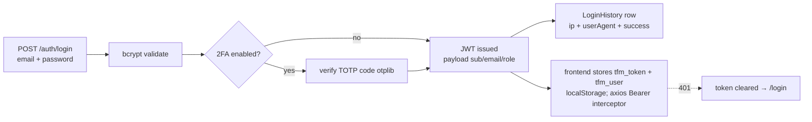

# SYS-01 — User Accounts, Roles & Permissions

Auth, RBAC and user lifecycle across the whole ERP. Generated from a full code read (June 2026).

## 1. Authentication

- JWT strategy re-fetches the active user per request (`jwt.strategy.ts`); inactive users are dead tokens.
- 2FA: `POST /auth/2fa/setup` (TOTP secret) → `POST /auth/2fa/enable` (verify) — `otplib.authenticator`.
- Every login attempt audited in `LoginHistory` (success + failures, IP, UA).

## 2. RBAC — module × level

- **Modules (10):** `home, finance, crm, rentals, partners, production, hr, compliance, reports, setup` (sidebar alias: `maintenance → rentals`).
- **Levels:** 0 none · 1 view · 2 edit · 3 manage.
- **Roles (13):** SYSTEM_ADMIN · FINANCE_MANAGER · ACCOUNTANT · RENTAL_MANAGER · RENTAL_COORDINATOR · DISPATCHER · DRIVER · MAINTENANCE · PRODUCTION_MANAGER · PRODUCTION_COORDINATOR · CREW · HR_MANAGER · SALES.
- Defaults hardcoded per role (`permissions.service.ts DEFAULTS`); DB `RolePermission` rows override per cell; **SYSTEM_ADMIN is always level 3 everywhere** and cannot be downgraded.
- Enforcement: `@RequirePermission(module, level)` metadata read by `PermissionsGuard` after `JwtAuthGuard` → 403 below level. Example: the whole accounting controller requires `finance ≥ 1`.
- Production budget **lifecycle** transitions add a second gate on top: project crew role EP/Producer/LP or system FINANCE_MANAGER/SYSTEM_ADMIN (see prod doc 12).

## 3. Users

- **Employee-driven creation only:** a user account is born from an HR `Employee` (1:1 `employeeId`), copying name/department/job — HR is the single source of truth; `GET /users/available-employees` filters out terminated/resigned and already-linked.
- `User`: fullName, email (unique), passwordHash (bcrypt, min 8), `role` (enum), `activity` RENTAL|PRODUCTION|BOTH, isActive, twoFactor*, lastLoginAt, `approvalLimit` (feeds the approvals chain), employeeId.
- Update path only touches role/activity/isActive/approvalLimit/email/password — personnel data stays in HR.

## 4. Frontend behavior

- Sidebar renders only modules where `perms[key] ≥ 1` (`canSee`, layout.tsx); perms cached in `tfm_perms`, refreshed on mount via `GET /permissions/me`.
- **Users page** (`/users`): list + 2-step create (pick employee → credentials/role/activity).
- **Roles editor** (`/setup/roles`): 13×10 matrix, level color-coded, `PUT /permissions/matrix/:role` (requires `setup` 3); changes apply on next login/refresh.

## 5. Route inventory

| Route | Purpose |
|---|---|
| `POST /auth/login` · `GET /auth/me` · `POST /auth/2fa/setup` · `POST /auth/2fa/enable` | auth |
| `GET/POST /users` · `GET/PUT /users/:id` · `GET /users/available-employees` | user lifecycle |
| `GET /permissions/me` · `GET /permissions/matrix` · `PUT /permissions/matrix/:role` | RBAC |

Files: `backend/src/auth/*`, `backend/src/permissions/*`, `backend/src/users/*`, `frontend/src/app/login/page.tsx`, `(dashboard)/layout.tsx`, `(dashboard)/users/page.tsx`, `(dashboard)/setup/roles/page.tsx`.
