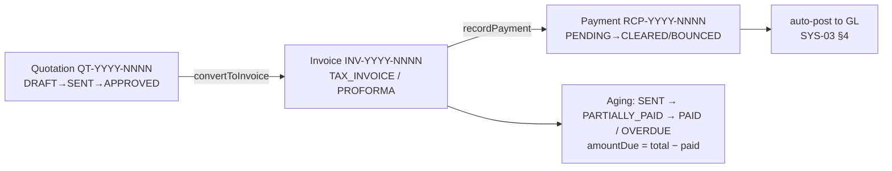
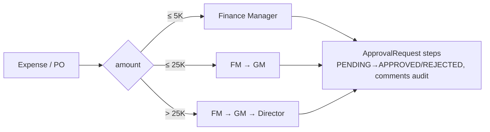

# SYS-02 — Finance Module (Sales, AR, VAT, Expenses, Collections, Approvals)

Company-side finance: quotations → invoices → payments, VAT, expenses with approval routing, collections. Generated from a full code read (June 2026). Project-side money lives in the production docs (esp. 18).

## 1. Document chain

All numbering via `DocumentSequence` (prefix + year + atomic increment): QT, INV, RCP, EXP, JE, PO, PRD.

## 2. Models (essentials)

| Model | Key points |
|---|---|
| **Quotation / QuotationItem** | clientId, bankAccountId, activity RENTAL/PRODUCTION, validUntil, discount + deduction + VAT; status DRAFT/SENT/APPROVED/REJECTED/INVOICED |
| **Invoice / InvoiceItem** | quotationId link, invoiceType TAX_INVOICE/PROFORMA, dueDate, line-level `TaxRate`, amountDue; + ZATCA/JoFotara e-invoicing field block (doc 18 §2.2–2.3) |
| **Payment** | invoiceId, method BANK_TRANSFER/CHEQUE/CASH, clearedAt (feeds bank rec) |
| **BankAccount** | company accounts: IBAN/SWIFT, defaults per doc type, `qrPaymentData`; **`projectId`** = dedicated production account (audit chain, doc 18 §5.4) |
| **TaxRate** | UAE VAT 5% standard + ZERO_RATED / EXEMPT / OUT_OF_SCOPE, seeded |
| **Expense** | EXP numbering, category, VAT split, supplierId; DRAFT→PENDING_APPROVAL→APPROVED→PAID |
| **Client / ClientDocument** | TRN (UAE tax reg), creditLimit, paymentTermDays (30), doc vault (trade license, VAT cert, LPO…) |

**VAT math:** taxable base = subtotal − discount; deduction (capped at base) applies **before** VAT; `VAT = rawVat × (base − deduction)/base`; total = base − deduction + VAT.

## 3. Approvals (amount-based chain)

`User.approvalLimit` + role drive who can clear a step. Queue UI: `/finance/approvals`.

## 4. Collections

- `aging()` AR buckets (current/30/60/90/90+), per-client with last-reminder log.
- `sendReminder()` templated emails (BEFORE_DUE, DUE, OVERDUE_7/14/30) via the company SMTP (`CompanyProfile.emailSettings`); auto-scan timer every 6h.
- Client statements (`/finance/collections/statement/:clientId`).

## 5. Frontend pages

`/finance` dashboard · quotations (+new/[id]) · invoices (+new/[id]/edit) · payments · expenses · approvals · collections (+statement) · vat-return · suppliers · services · report-builder/designer. Bank Reconciliation & Chart of Accounts links sit in the same Finance menu but belong to SYS-03.

## 6. Route inventory (prefix `/api/v1/finance`)

quotations CRUD + convert · invoices CRUD + status + record-payment + aging · payments list/status/summary · vat CRUD/seed · bank-accounts CRUD + defaults · expenses CRUD · suppliers CRUD · services CRUD · reports (aging, VAT summary). Approvals under `/approvals`, collections under `/collections`.

Files: `backend/src/finance/*`, `backend/src/approvals/*`, `backend/src/collections/*`, `frontend/src/app/(dashboard)/finance/*`.
