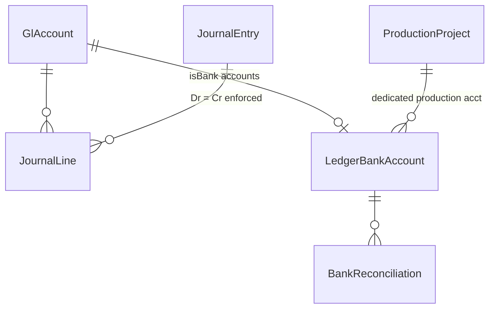
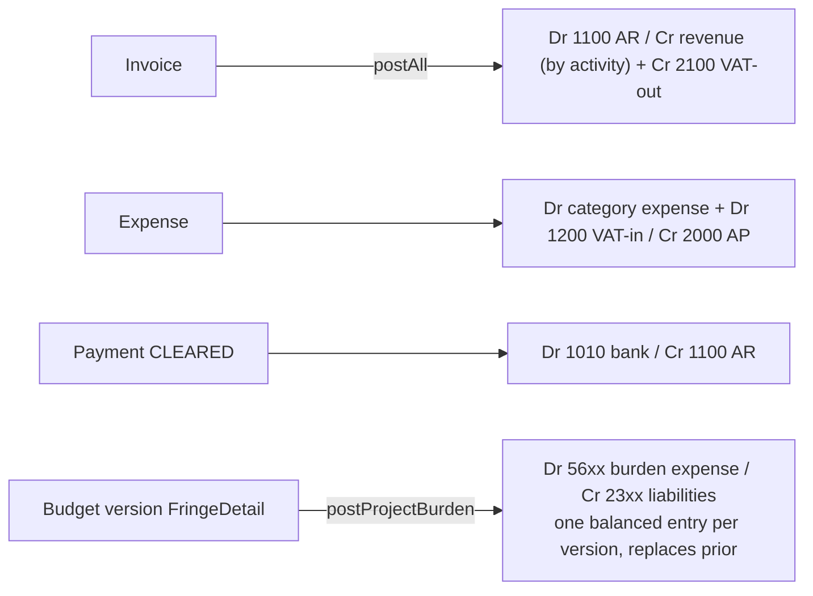

# SYS-03 — Core Accounting (GL, Journals, Trial Balance, Bank Reconciliation)

The double-entry heart of the company books. Generated from a full code read (June 2026). The production module bridges into this layer via burden posting today and (spec) the project-entity trial balance + weekly-report guard (prod doc 18 §5).

## 1. Data model

- **GlAccount**: code + name + type ASSET/LIABILITY/EQUITY/INCOME/EXPENSE (+subtype, isBank). ~40 UAE-SME accounts seeded (assets 1000–1510, liabilities 2000–2360, equity 3000s, income 4000s, expense 5000–6900).
- **JournalEntry**: JE-YYYY-NNNN, `source` MANUAL|SYSTEM, `sourceType/sourceId` (INVOICE | EXPENSE | PAYMENT | FRINGE_BURDEN) — the idempotence key; status **DRAFT → POSTED → VOID** (posted entries cannot be edited or deleted, only voided — audit trail preserved).
- **JournalLine**: debit/credit (entry must balance), `reconciled/reconciledAt` for bank rec.
- Normal balances: debit = ASSET/EXPENSE, credit = LIABILITY/EQUITY/INCOME.

## 2. Manual journals

`/accounting/journals/new` → line-by-line builder with live balance validation → save DRAFT or post immediately. POSTED is immutable; VOID reverses status while keeping the row (the production-ledger SOX void pattern in prod doc 18 §3.4 mirrors this).

## 3. Reports

- **Trial Balance** (`trialBalance(to?)`): POSTED lines only → per-account net → debit/credit balance columns by account-type normality → totals must equal.
- **General Ledger** (`generalLedger(accountId, from, to)`): running balance drill-down.
- **Financial summary**: P&L + balance-sheet rollup by type, netProfit = INCOME − EXPENSE.

## 4. Auto-posting (idempotent)

`postingStatus()` shows what's pending; re-runs skip anything with an existing (sourceType, sourceId) entry — nothing double-posts.

## 5. Bank reconciliation (two-phase)

1. **Workspace** (`/accounting/bank-rec`, `GET bank-accounts/:id/reconcile`): all POSTED lines on the GL bank account; user toggles `reconciled` per cleared line against the statement.
2. **Complete**: creates a `BankReconciliation` row (statementDate, statementBalance vs clearedBalance, OPEN→COMPLETED).

`LedgerBankAccount.projectId` scopes a dedicated **production** account — reconciling it = reconciling the project's cash (ADFC audit chain, prod doc 18 §5.4). The weekly cost-report guard (spec) reads TB balance + rec completion from here.

## 6. Route inventory (prefix `/api/v1/accounting`, guard `finance ≥ 1`)

accounts CRUD + seed · journals CRUD + post + void · trial-balance · ledger/:accountId · summary · bank-accounts CRUD + :id/reconcile + complete · posting-status · post-all · post-burden/:versionId.

Files: `backend/src/accounting/*`, frontend `/accounting/{accounts, journals, trial-balance, ledger, bank-rec}`.
