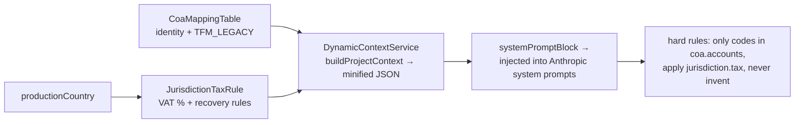

# SYS-04 — AI Architecture (every Claude touchpoint in the system)

All Anthropic integrations, their guardrails, and the dynamic-context (RAG) pipeline. Generated from a full code read (June 2026). Supersedes/extends prod doc 08.

## 1. The guardrail constitution (applies to every call)

1. **AI never writes live numbers.** Every AI output lands as a PENDING proposal, a DRAFT row, or a suggestion in a human review UI.
2. **Allow-listed sources only** for anything fetched (union/commission/government domains — `labor.service.ts SOURCE_ALLOWLIST`).
3. **Structured output enforced** — forced tool-use schema where supported, strict JSON prompts elsewhere; tolerant parsers that never throw.
4. **Validation after generation** — account codes checked against the real CoA (hallucinations rejected with reasons), rates sanity-checked, confidence clamped 0–1.
5. **Secrets in `backend/.env` only**: `ANTHROPIC_API_KEY`; model overrides `LABOR_AI_MODEL`, `MM_AI_MODEL` (default `claude-3-5-sonnet-20241022`).

## 2. Dynamic context (RAG) pipeline

`backend/src/production/context/dynamic-context.service.ts` — read-only; geo-tree fallback for tax rules; exported from ProductionModule for any consumer.

## 3. Call-site inventory

| # | Where | What it does | Output gate |
|---|---|---|---|
| 1 | `breakdown/script-import.service.ts` `callLLM` + `aiElementsForBatch` | Script → scene breakdown elements (20 categories incl. CAMERA, ADDITIONAL_LABOR, MECHANICAL_FX, ANIMAL_WRANGLER), 6–8 scenes/batch | Elements stored as breakdown rows; budget impact only via human-driven mapping/generate steps |
| 2 | `labor/labor.service.ts` `aiResearch` / `aiUpdateAll` / incentive check | Reads allow-listed union/commission sources, extracts rates **with verbatim citation + confidence** | Files PENDING `RateChangeProposal`s — approved only in Rate Approvals UI |
| 3 | `labor/labor.service.ts` `refreshRates` | No AI extraction — content-hash change detection on trusted sources | PENDING REFRESH review proposals |
| 4 | `movie-magic/ai-mapping.service.ts` `aiMapBudgetLines` | MM import lines → Master CoA mapping, **forced tool-use** (`submit_line_mappings`, 50/batch), grounded in DynamicContext | Suggestions only; codes hard-validated vs allowed set; human review table → explicit confirm clones a WORKING version |
| 5 | `costing/costing.service.ts` `extractDocFields(task)` | Vision OCR, 3 task prompts: **INVOICE** (vendor invoice → DRAFT cost), **PETTY_CASH_RECEIPT** (→ DRAFT petty-cash spend, pre-fills Cash panel), **DIGITAL_TIMESHEET** (→ PENDING timecard). Images + `anthropic-beta: pdfs-2024-09-25` for PDFs; confidence on every result | DRAFT transaction / PENDING timecard — counts nothing until approved |

## 4. UI surfaces

- **Rate Approvals** (Production menu): proposal queue + *Refresh sources* / *AI research* buttons, diff view, cited quotes, confidence badges.
- **CoaMappingReviewTable** (Project Settings ▸ MM sync, AI-mapped method): per-line suggestion + VAT treatment + confidence bar (red < 70%) + manual override dropdown → "Confirm and Push to Budget".
- **Script → full setup wizard** (Schedule tab): breakdown → schedule → budget orchestration with the visual mapping step.
- **PO upload-invoice** (Purchasing): OCR result lands as a draft for review.

## 5. Provenance & audit

`BudgetLineItem.origin` (MANUAL | AI_GENERATED | SCRIPT_IMPORT | AUTO_BREAKDOWN | MOVIE_MAGIC_IMPORT | MANUAL_OVERRIDE) + `aiSuggestedRate/Quantity` preserve the AI's original after human edits. Proposals keep source, quote, confidence, reviewer, and notes forever.

## 6. Planned (spec — prod doc 18)

E-invoicing middleware (ZATCA/JoFotara) is deterministic, not AI. No new AI surfaces are planned without the same constitution: context-grounded, structured, validated, human-gated.
