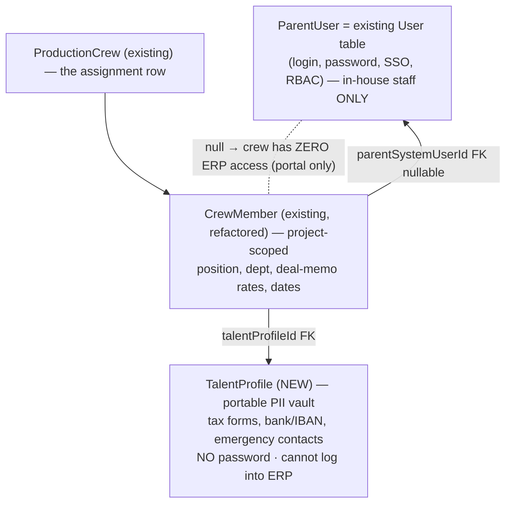
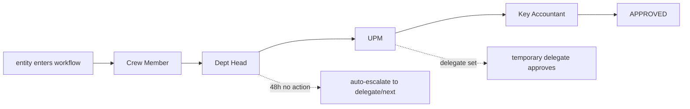
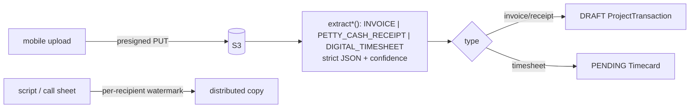
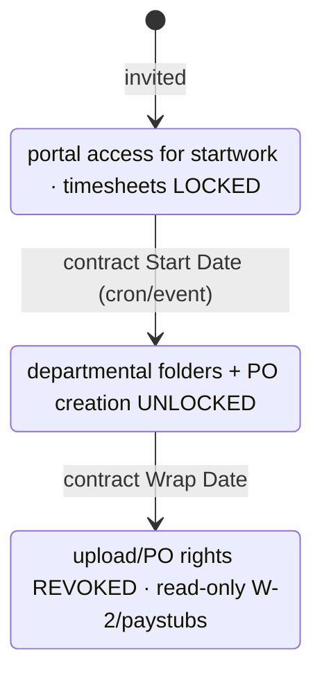

# SYS-05 — V1.2: IAM, Identity Separation, Workflow Engine, Vault & Workforce Lifecycle

**Status: 🔶 SPEC** (V1.2 architecture blueprint). Source: "Your design approach…" brief. This document maps the brief onto the existing codebase, flags what's reusable vs. net-new vs. conflicting, and proposes a build sequence. Nothing here is built yet — it's the agreed target.

> Guiding principle from the brief: **Authentication (who can log into the ERP) is decoupled from Project Representation (who appears on a crew list).** Temporary crew must never become full ERP users — that's user bloat, licensing cost, and attack surface.

---

## ★ RECOMMENDED PATH ("enhance what we have") — agreed scope

The full brief is enterprise-studio scale. For this system's actual stage, the high-value / low-risk subset is:

| # | Slice | Decision | Status |
|---|---|---|---|
| 1 | **`parentSystemUserId` link + portal-only access rule** | Add the one nullable FK; null = zero ledger access. Delivers the brief's core security goal WITHOUT the risky 172-crew PII migration. | ✅ DONE — `CrewMember.parentSystemUserId`→User, link/unlink + parent-users endpoints, `hasErpAccess()` rule helper, crew-form link card + directory "Access" badge |
| 2 | **Per-project role layer** (ProjectRoleAssignment) | LAYER on top of the existing global role matrix, don't replace it. | ✅ DONE — `PermissionTemplate` (6 seeded: Line Producer/UPM/Key Accountant/Coordinator/Dept Head/Observer) + `ProjectRoleAssignment`; `projectAuthority()` resolver; Project Settings "team & access" card; field-level security live on project crew list (Dept Head/Coordinator/Observer get pay & PII blanked) |
| 3 | **Expanded OCR** (petty-cash receipts + digital timesheets) | Direct extension of `extractInvoiceFields`; DRAFT/PENDING like invoices. | ✅ DONE — `extractDocFields(task)` with INVOICE / PETTY_CASH_RECEIPT / DIGITAL_TIMESHEET prompts; receipt→DRAFT spend ("Scan receipt" in Cash tab), timesheet→pre-filled timecard ("Scan timesheet" in Accounting ▸ Payroll). Both review-before-post, confidence shown |
| — | Full PII split into `TalentProfile` | **Deferred** — lighter `parentSystemUserId` link achieves the security goal; revisit only if PII must be shared across many projects. | spec only |
| — | DAG approval engine | **Deferred** — current amount-tier chain works; build when a real 4-tier production needs it. | spec only |
| — | **S3 presigned uploads / video upload** | **DROPPED for now** — no video uploads; local `backend/uploads` stays. No AWS dependency. | not planned |
| — | Offline mobile app, lifecycle cron | **Deferred** — spec only. | spec only |

Sections below retain the full brief for reference; the ★ table above is the live plan.

---

## 0. What already exists (reuse, don't rebuild)

| Brief asks for | Already in system |
|---|---|
| Tokenized invitation links (JWT, TTL) | ✅ `vendor-onboarding.service.ts` — JWT sign/verify, TTL hours, public portal route. **Reuse this exact pattern for crew.** |
| Crew directory record | ✅ `CrewMember` (global directory) + `ProductionCrew` (project assignment) — but NOT yet split into the 3-entity model below |
| Parent users + RBAC | ✅ `User` (13 roles × 10 modules × 4 levels, SYS-01) — but flat/global, no per-project authorization |
| Invoice OCR (Anthropic vision) | ✅ `costing.service.ts extractInvoiceFields` — DRAFT-only, confidence scored. **Extend, don't replace.** |
| Approval routing | ✅ `approvals.service.ts` amount-based chain — flat, to be superseded by the DAG engine |
| Offline-first crew capture | ✅ PWA petty-cash + locations sync queue already proven (prod core) |

---

## 1. Three-entity identity separation

The brief's clean split. Maps onto our models as:

**Schema (SPEC):**
- **`TalentProfile`** (new, global): the portable PII vault — splits the sensitive columns currently on `CrewMember` (passport, IBAN, bank, emergency contact, tax docs) into a password-less profile keyed by a verified email. Our existing `CrewMember` becomes the *directory shell* + link.
- **`CrewMember.talentProfileId`** → the vault (PII lives once, reused across projects).
- **`CrewMember.parentSystemUserId String?`** → optional FK to `User`. **Null = portal-only, zero ledger access.** Non-null = this crew row IS a real ERP user (staff LP, key accountant) and their RBAC unlocks per project.

**Migration note (conflict):** today `CrewMember` already holds the PII the brief wants in `TalentProfile`, and `ProductionCrew.userId` already exists. The refactor must move PII → TalentProfile without breaking the 172 imported crew. Done as a data migration, not a drop.

### Onboarding flow (passwordless OTP)

```mermaid
flowchart LR
    ADD[Accountant adds crew to project] --> TOK[single-use JWT, TTL 72h<br/>reuse vendor-onboarding pattern]
    TOK --> LINK[Startwork Portal link emailed]
    LINK --> CLICK[Jane clicks → token decoded → email read]
    CLICK --> OTP[6-digit OTP to email/phone<br/>form stays BLANK — no PII pre-fill pre-auth]
    OTP --> VERIFY{OTP valid?}
    VERIFY -->|yes| PULL[pull TalentProfile → pre-fill startwork]
    PULL --> SIGN[review + e-sign project deal memo]
    SIGN --> DONE[new CrewMember row in Project X,<br/>linked to TalentProfile, status COMPLETE]
```

Security rule (explicit in brief): **never pre-fill PII for an unauthenticated click** — the form is blank until OTP succeeds.

---

## 2. Centralized Role & Permission Engine (granular RBAC)

Decouple global auth from **project-level** authorization.

**Schema (SPEC):**
- `PermissionTemplate` — reusable industry role definitions (e.g. "Line Producer", "Dept Head", "Key Accountant") with a permission payload.
- `ProjectRoleAssignment` — links a `User` (or CrewMember.parentSystemUserId) to a `ProductionProject` with a `PermissionTemplate`. This is where per-project authority lives — the same person can be LP on one show, observer on another.
- `FieldLevelAccess` JSON on the template — hides sensitive fields (day rates, SSN/IBAN, deal terms) from roles like Dept Head. Enforced server-side (response projection) AND surfaced in UI.

**Relationship to existing RBAC:** the global `User` RBAC matrix (SYS-01) stays as the coarse gate ("can this person touch Production at all"); `ProjectRoleAssignment` is the fine gate ("what can they do on *this* project"). Production budget lifecycle already does a lightweight version of this (crew role EP/Producer/LP) — that becomes a `PermissionTemplate`.

**Enforcement (✅ live, FAIL-OPEN):** `assertProjectCapability(projectId, userId, capability, minLevel)` — if a user has **no** project-role assignment, the global RBAC governs unchanged (no lockout risk); only when they DO have a role is its capability flag enforced. Wired into the three core financial-authority actions: **cost-report snapshot lock** (`costReport: 'lock'`), **budget-transfer approval** (`transfers: 'approve'`), and **PO approval** (`po: 'approve'`). `GET /production/projects/:id/my-authority` exposes the caller's effective authority so the UI can pre-disable buttons. Field-level hiding (pay/PII) on the project crew list also live. Clean extension points (same one-line `assertProjectCapability` call): overage approval (separate service), budget-line edit (`budget: 'edit'`), ledger edit (`ledger: 'edit'`).

---

## 3. Dynamic multi-stage approval engine (DAG)

Replace the flat amount-chain with a configurable Directed Acyclic Graph.

**Schema (SPEC):**
- `WorkflowDefinition` — admin-built template (nodes + edges).
- `ApprovalNode` — a step: approverRole/template, order, SLA hours, escalation target, delegate.
- `WorkflowInstance` — a live run bound to an entity (PO, Timecard, Expense, BudgetTransfer, Overage); current node pointer + history.

- **Auto-escalation:** cron/event listener bumps a node unactioned >48h.
- **Delegates:** temporary approver substitution with audit.
- **Supersedes** `approvals.service.ts`; the existing amount-tiers become one seeded `WorkflowDefinition` so nothing breaks during migration.
- Must honor the existing **PENDING-first / approval-gate** constitution and `assertOpen()`/void rules.

---

## 4. Document Vault & expanded OCR

Extend `costing.service.ts extractInvoiceFields` — do not replace.

**Schema/infra (SPEC):**
- **S3 presigned URLs** — new routes issue short-lived upload URLs so heavy mobile uploads (scout videos, receipt photos) bypass the API server. (Today uploads go to `backend/uploads` via Multer — fine for light files; presigned S3 is the scale path.)
- **OCR task expansion** — the vision prompt gains `PETTY_CASH_RECEIPT` and `DIGITAL_TIMESHEET` modes alongside `INVOICE`. Same guardrails: strict JSON + confidence → lands as **DRAFT transaction** or **PENDING timecard**, never live.
- **Watermarking** — scripts and call sheets distributed through the vault get per-recipient watermarks (name + timestamp) for leak tracing.

---

## 5. Crew & Department Portal (offline-first)

A walled-off interface — crew **never** reach the financial ledger.

- **Auth:** the token/OTP links from §1 only — no parent credentials.
- **Architecture:** PWA / React Native + SQLite, background sync (reuses the proven petty-cash/locations sync-queue pattern).
- **Endpoints (SPEC):** offline timecard submit, GPS-tagged scout photo upload (presigned), watermarked script view, paystub/W-2 read. All scoped to the crew's own `CrewMember` rows; `parentSystemUserId = null` guarantees no ledger reach.

---

## 6. Workforce lifecycle automation

Access governed by the production calendar (we already anchor shoot dates on budget lock — prod doc 18).

- Cron jobs / event listeners on `CrewMember` contract dates (start/wrap) flip capability flags — state-driven provisioning, no manual de-provisioning.
- Ties into the existing scheduled-tasks infrastructure.

**✅ Foundation DONE (no schema change):** `lifecycleState(start, end)` computes **PRE_SHOOT / ACTIVE / WRAPPED / UNDATED** live from each `ProductionCrew` contract date vs today. Surfaced as a badge (Prep/Active/Wrapped) on the project crew-assignments table; `GET /production/crew/project/:projectId/workforce-status` returns counts + the dated roster. The capability-flipping cron is the remaining piece — it reads this same state, so it's a thin add when the portal exists.

---

## 7. Integrity rules carried from V1.1 (must not break)

1. AI OCR stays DRAFT/PENDING-only with confidence scores.
2. Period locks (`assertOpen`) and the SOX void pattern (doc 18) bind every new write/destroy path.
3. Approval gates stay PENDING-first.
4. Portal crew (`parentSystemUserId = null`) have **zero** ledger access — enforced server-side, not just hidden in UI.
5. PII (TalentProfile) is never exposed to an unauthenticated session.
6. The 172 imported crew + existing users migrate without data loss.

## 8. Proposed build sequence (dependency order)

1. **Three-entity identity** (TalentProfile split + `parentSystemUserId`) — foundation for everything.
2. **Crew Startwork Portal + OTP onboarding** (reuse vendor-onboarding JWT).
3. **ProjectRoleAssignment + FieldLevelAccess** (per-project RBAC).
4. **DAG approval engine** (migrate amount-tiers into it).
5. **Expanded OCR + presigned uploads + watermarking.**
6. **Lifecycle automation cron.**
7. **Offline portal endpoints.**

Each slice ships behind the V1.1 guardrails and updates this doc's tags ✅/🔶 as it lands.
