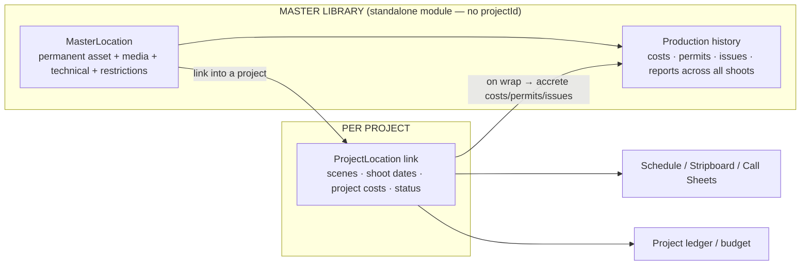

# SYS-07 — Film Scout & Location Management System

**Status: ✅ BUILT (phases 1–5 + hardening).** A standalone enterprise domain (like Rentals) — a permanent company **Location Intelligence, Scouting, Permitting, Logistics & Operations** platform — that *also* integrates per-project both ways. Phases 1–5 are implemented, plus the three follow-ups: **offline PWA queue for scout field capture**, **permits routed through the universal approval engine** (LOCATION_PERMIT_STANDARD chain), and **map clustering + usage-weighted heatmap**. This doc fixes the architecture; the phase list tracks build status.

---

## 1. The core architectural shift: master library vs project usage

> **Rule (from the brief):** projects don't own locations. Locations live in a **Master Location Library** (a company asset that outlives any project). A project **links** to a master location for a shoot; project-specific cost/scenes/schedule stay on the link; the shoot's history **accretes back** to the master.

**Today vs target:** the existing `Location` model is project-scoped (per-project directory). It becomes the **`ProjectLocation` link**, gaining an optional `masterLocationId`. A new **`MasterLocation`** sits above it. Existing project locations are **promoted** into the master library (dedupe by name + geo) and linked — no data loss, and historical projects keep their rows.

---

## 2. Data model (new + refactor)

| Model | Role |
|---|---|
| **MasterLocation** (new) | The permanent asset: name/aliases, category, full geo (country→district, GPS, what3words, timezone), access, technical (power/internet/cellular/water/sound), restrictions, aggregate production-history stats. No projectId. |
| **LocationMedia** (new) | Photos / video / 360 / drone / floor plans / CAD, attached to a MasterLocation; versioned, reuses the upload + document vault. |
| **ProjectLocation** (= existing `Location`, refactored) | Per-project usage: `masterLocationId?`, scenes, shoot dates, status in this project, project-specific costs. Backward-compatible. |
| **ScoutAssignment** (new) | A scouting mission: project, scene/visual refs, mood boards, budget target, due date, priority, type (Initial/Photo/Director/Producer/Tech recce/Permit/Final), assignee. |
| **ScoutSubmission** (new) | Field capture against an assignment: GPS, media, voice notes, evaluation form, owner correspondence — offline-first (existing PWA sync pattern). |
| **TechRecce** + **RecceNote** (new) | Per-department notes (Camera/Grip/Electric/Sound/Art/Construction/Transport/Security/Stunts/SFX/VFX): risks, equipment, crew, access, safety. |
| **LocationEvaluation** (new) | Weighted scoring (visual/access/logistics/cost/safety/production-value/permit-complexity/feasibility/comfort/schedule) → side-by-side comparison. |
| **LocationPermit** (new) | Type, authority, jurisdiction, application/approval/expiry dates, status, fees, documents (OCR-able). |
| **LocationRisk** (new) | Hazards, risk ratings, mitigation, emergency procedures, medical access, evacuation, weather/environmental/community risks. |
| **LocationCost** | Not a new ledger — project-side location costs post as `ProjectTransaction`s (Location account 3600) and accrete to the master's history on wrap. |

---

## 3. Reuse the engines we already built (don't rebuild)

| Need | Reuse |
|---|---|
| Location approval chain (Scout → Senior Scout → LM → PM → Producer → EP) | **Universal Workflow Engine** — `WorkflowEntity.LOCATION` already exists. Seed a LOCATION_APPROVAL definition. |
| Permit OCR (extract authority/dates/fees) | **AI/OCR engine** — add a `PERMIT` task to `extractDocFields`. |
| Scout/permit/agreement documents | **Document Vault** (`ProjectDocument` + entity link), with watermarking later. |
| Who can scout/approve, field-level | **Per-project roles** (`PermissionTemplate`: add Location Manager / Scout) + global roles. |
| Mobile field capture + offline | **PWA sync-queue pattern** already proven (petty cash + current locations). |
| Location costs → budget/accounting | **Project ledger + cost report** (account 3600 Location), FX, period locks, payment controls. |
| Audit trail | **Audit interceptor + workflow ApprovalAction** — every scout submission, approval, permit, cost change. |
| Schedule/call-sheet linkage | Existing **stripboard / call sheets** read `ProjectLocation`. |

This domain is mostly **composition of existing engines + new domain data**, not new infrastructure — which is the whole point of the SYS-06 north star.

---

## 4. Two-way integration

- **Master → Project:** from a project, "Add location" searches the **library** and links a `MasterLocation` (creating a `ProjectLocation`); you set scenes/dates. Pull-through: technical info, access, restrictions, media, and *prior production history* (costs, permit lead times, issues) are visible immediately — the value compounds.
- **Project → Master:** as the shoot runs, project location costs, permits obtained, risk findings, and the wrap report **write back** to the master's history. Next production scouting the same place sees real numbers.

---

## 5. Placement & navigation

- **Standalone top-level module "Locations"** in the sidebar (peer of Rentals/Production) → Library, Scout Assignments, Map, Permits, Reports.
- **Inside a project** → the Locations tab becomes "linked locations" (search library, link, set scenes/dates, see project costs) — not a standalone directory.

---

## 6. Phased build (each slice ships behind the guardrails)

1. ✅ **Master Library foundation** — `MasterLocation` + `LocationMedia`, standalone module + CRUD + media gallery; **migrate** existing project `Location`s into the library; `ProjectLocation.masterLocationId` link + "link from library" in the project tab. *(This is the backbone — everything else hangs off it.)*
2. ✅ **Scout assignments + field capture** — `ScoutAssignment` (brief: project, scenes, type, priority, budget target, due date, scout) + `ScoutSubmission` (field candidate: GPS, photos, owner, est. fee, evaluation; idempotent `clientId` for offline replay). Scouting page (assignments board + candidate review). Accepting a candidate **promotes it into the Master Library** (dedup) and optionally links the project — closing the scout→library loop. ✅ **Offline PWA queue**: the capture form persists submissions to IndexedDB when offline (`scoutSubmission` kind in `useOfflineSync`) and auto-syncs on reconnect; OfflineSyncBar + "Save offline" on the scouting page.
3. ✅ **Tech recces + weighted evaluation/scoring** — `TechRecce` + per-department `RecceNote` (risks/equipment/crew/access/safety), and `LocationEvaluation` scoring 10 criteria 1-5 (permit-complexity inverted) → server-computed weighted score + recommendation. Per-card **Assess** modal (Evaluation sliders + Tech recce by department) and a project-level **Compare** table ranking candidate locations by score. Endpoints under `/location-assessment`.
4. ✅ **Permits + risk + location budgeting** — `LocationPermit` lifecycle (type, authority, jurisdiction, dates, fee, conditions, doc) with **AI OCR intake** (Anthropic vision PERMIT prompt → suggested fields, review-before-save) + `LocationRisk` register (category, likelihood × impact = score, mitigation, emergency/evacuation/medical). Location costs (fees + permit fees) post to the project ledger (account "Location") and **accrete to the master library** history via `recomputeHistory`. Permits/Risk tabs in the Assess modal. ✅ **Permit approval routing**: "Submit for approval" routes a permit through the universal workflow engine (LOCATION entity, seeded `LOCATION_PERMIT_STANDARD`: Location Manager → UPM → Producer); final approval flips the permit to APPROVED via `applyCompletionEffect`, appears in My Approvals.
5. ✅ **Map + reporting/deliverables + analytics** — interactive **Google map** (`/locations/map`) plotting every mapped library location with info windows + focusable side list; the browser key is served from `backend/.env` via `/locations-library/map-config` (never baked into the build — restrict it by HTTP referrer in Google Cloud Console). Library **analytics** (total spend, countries, top-used, mapped count). Printable **Location Pack** (`/locations/pack/[projectId]`) — a per-project location book with media, details, permits, and risk register, launched from the project Locations header (print / save-as-PDF). ✅ **Advanced GIS**: marker **clustering** (@googlemaps/markerclusterer) + a usage-weighted **heatmap** toggle (Google visualization layer). ◐ Mapbox provider alternative remains optional.

---

## 7. Decisions (locked)

1. **Migration:** ✅ Promote ALL existing project locations into the master library now, deduped by name+geo, and link them back.
2. **Map/GIS provider:** ✅ Mapbox / Google Maps — richer satellite/terrain/street + routing. Lands in **phase 5**; needs an API key + billing set up at that point (slice 1 needs no map).
3. **Placement:** ✅ Standalone top-level "Locations" module (peer of Rentals), per the "standalone like rentals" intent; also surfaced per-project.
4. **First slice:** Master Library backbone (this build).

## 8. Slice 6 — LM document vault & compliance (from the mailbox study) ✅

A location manager's real mailbox showed the job is mostly **document lifecycle**: **NOCs** (bilingual EN/AR No Objection Certificates) are the dominant artifact, followed by **location agreements/releases**, **insurance (PLL)**, **location guides**, **risk-assessment questionnaires**, owner IDs and rental quotes — exchanged with twofour54, Aldar, Masdar, Abu Dhabi Police, the Film Commission, SZGMC, Jubail Mangrove Park and production clients.

Built to mirror that:

- **`LocationDocument`** — a typed per-location vault (category, status DRAFT→REQUESTED→RECEIVED→SIGNED/ISSUED→EXPIRED, language EN/AR/BILINGUAL, party/authority/ref, issue/sign/**expiry** dates, amount, file + OCR). Covers NOCs, agreements, releases, insurance, guides, risk forms, IDs, quotes, permit docs.
- **Bilingual NOC generator** — `POST …/noc` renders a print-ready English + Arabic NOC letter from the location + production data.
- **Compliance gate** — `GET …/compliance`: signed agreement + valid (non-expired) insurance + NOC ⇒ "clear to confirm"; flags expiring (<30d) and expired documents.
- **LM pipeline** — `Location.pipelineStage`: Sourcing → NOC requested → Agreement sent → Permit applied → Insurance received → Confirmed → Wrapped.
- UI: a **Documents** tab, stage selector and compliance badges in the Assess modal.

A by-product of the same study: a de-duplicated **contact directory** of clients/venues/authorities exported to Excel for the team.

---

## 8b. Standalone module + per-project (dual-target operations)

The Locations module is a **standalone business module** (like Rentals) *and* a per-project capability. The library asset (`MasterLocation`) is company-level; a project links to it via `Location`. As of slice 7, the operational records are **dual-target** — each `LocationPermit`, `LocationDocument`, `LocationSecurity`, `LocationPayment` hangs off **either** a master library location (standalone, no project) **or** a project location, exactly one set. Project-scope payments/security post to the project ledger; master-scope ones are managed without a project. Endpoints: standalone under `/locations-library/:id/{permits,documents,security,payments}` (+ `/authorities`); per-project under `/production/locations/...`. A shared `LocationOpsService` resolves the owner so one engine serves both. UI: the project Assess modal carries the full rich tabs; the library detail drawer's **"Operations (standalone)"** panel exposes **Documents, Permits, Security, Payments** running directly on the master asset — so the module is fully usable on its own, no project required.

## 9. Evidence from the LM mailbox (2,408 emails + attachments) — what the day really is

Full scan of the location manager's inbox+sent (2,408 messages; 814 carry document attachments, 2,163 of them PDFs). Topic prevalence (# messages mentioning, inbound/outbound):

| Topic | msgs | in/out | Read |
|---|---|---|---|
| **Permits** | 2124 | 1957/167 | ~88% of all mail — the core of the job, and it's a *spectrum*: ground filming, drone, road, airport, heritage |
| **Security / guards** | 1378 | 1278/100 | Huge, and **not in the module** — guards/marshals at locations |
| Schedule / dates | 878 | 762/116 | shoot/prep/wrap dates drive everything |
| twofour54 | 772 | 534/238 | primary permitting authority |
| **RTA / police / traffic** | 731 | 719/12 | road/traffic coordination — a distinct heavy stream |
| **Payments / deposits** | 559 | 467/92 | quote → deposit → balance with owners |
| NOC | 444 | 346/98 | ✅ covered (slice 6) |
| Recce / scout / site visit | 440 | 391/49 | ✅ covered (slices 2–3) |
| Access / keys | 377 | 314/63 | key handover logistics |
| Quotation / Invoice | 328 / 310 | — | location money flow |
| Drone / aerial | 214 | 168/46 | separate **GCAA drone permit** ("Drone NOC – filled.docx") |
| Insurance / PLL | 206 | 174/32 | ✅ covered (slice 6) |
| Risk assessment + **method statement** | 129 + 101 | — | travel together as the **HSE pack**; method statement category missing |
| Location agreement / release | 84 / 20 | — | ✅ covered |
| Call sheet / location guide | 59 / 30 | — | ✅ covered |

Attachment evidence (real filenames): many NOC letters, "AD Airport NOC", "Drone NOC", "QAW Location TCs" (Qasr Al Watan terms), DCT invitation letters, ground filming permits, purchase orders, schedules, call sheets, customer acknowledgement forms.

**Gaps the data exposes (beyond what slice 6 built):**

1. **Typed permits + authority directory** — permits are 88% of the work and span ground (twofour54), **drone (GCAA)**, **road/traffic (RTA + Police)**, **airport**, **heritage (DCT)**, parking. The current `LocationPermit.type` is free-text; it should be a typed set with the issuing authority as reusable records. *Highest ROI.*
2. **Security & marshals** per location — second-biggest topic (1,378 msgs), entirely absent: guard company, headcount, shifts, cost.
3. **Method statement** doc category + an HSE pack view (RA + MS together).
4. **Location payment schedule** — quote → deposit → balance → settled (559 payment msgs); today we only post a single cost.
5. **Email/attachment intake** — the mailbox *is* the system of record (814 doc-bearing emails). Importing `.msg`/forwarded mail straight into a location's document vault would capture the real workflow.

---

Per-domain detail and the ✅/🔶 tags will track build progress as slices land. Indexed in `docs/INDEX.md`.
